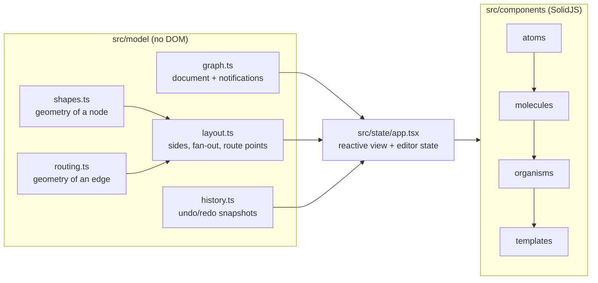
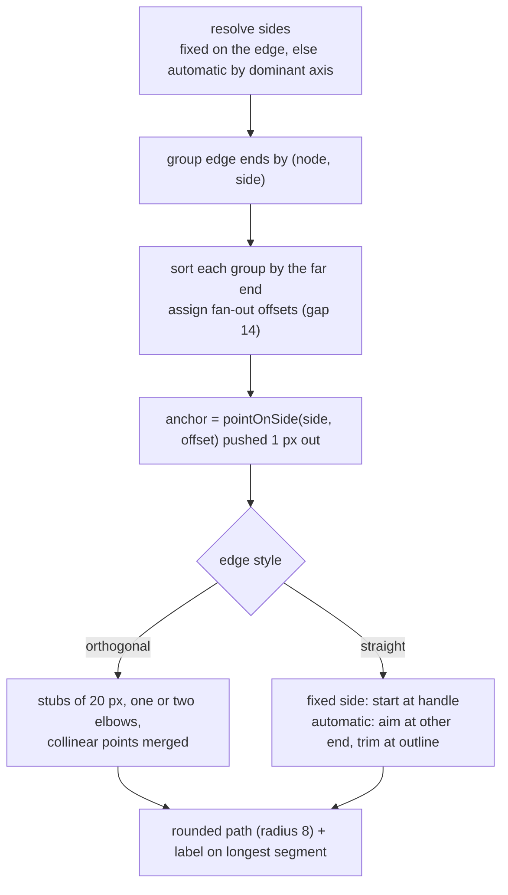
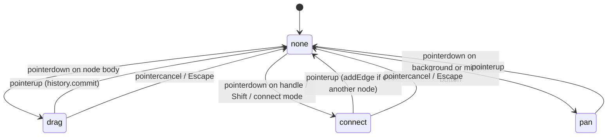
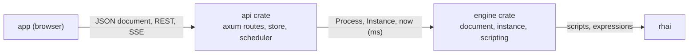

# Kesah architecture

This document explains the decisions and invariants behind Kesah, the things a reader cannot
recover by skimming the code. It is updated when a decision changes, not when code changes.
For usage and the file map see the [README](../README.md); for working rules see [AGENTS.md](../AGENTS.md).
Paths below are relative to `app/`, where the web application lives, unless they start with
`server/`, the Rust backend. The *Execution* chapter covers the server.

## Layers

Three rules keep the layers apart:

1. **The model never touches the DOM.** `Graph`, geometry, routing and history are plain TypeScript
   with no imports from `solid-js` or the browser. They are testable with nothing but Node and can be
   reused by any renderer. Anything that needs the DOM (measuring text, hit-testing) is done in the
   UI and handed to the model as numbers.
2. **The state is the only bridge.** Components never touch `Graph` mutation logic they do not own:
   they call `graph.*` methods through the state, read reactive accessors, and use the actions the
   state exposes (`select`, `fitView`, `revealNode`, `zoomAt`, `addNodeAt`, `undo`, `redo`).
3. **Components are organised by atomic design.** Atoms know nothing about the application; molecules
   compose atoms; organisms read the application state; the template only arranges organisms.

## The document: `Graph`

- Nodes and edges are stored in insertion-ordered maps and **mutated in place**. Ids are `n1, n2, …`
  and `e1, e2, …`, continuing after the highest id present when a document is loaded.
- Every mutating method notifies subscribers **once, and only when something changed** (moving a node
  to where it already is does nothing). Undo, autosave and the reactive state all hang off this.
- A node has a `type` (one of the eight BPMN elements) and a `variant` (event trigger, task type or
  gateway kind; `none` for types without variants). `NODE_VARIANTS` is the single list of what each
  type accepts; `setNodeType` keeps a variant the new type accepts and resets it otherwise, and
  `setNodeVariant` ignores anything the type does not accept. An edge has a `kind` (sequence,
  message, association) and a `condition` that only sequence flows keep.
- Execution properties (`script`, `delay`, `message` on nodes, `expression` on edges) are optional
  and **absent rather than empty**: the setters delete the field for blank text or an invalid number,
  `toJSON` writes only what is present, and `parse` copies only valid values. The editor does not know
  which element uses which property; it only decides which field to show. Leaving the sequence kind
  drops the expression along with the condition.
- `Graph.parse` is the only entry for untrusted data. It never throws for a bad node or edge; it drops
  them. It throws only when the value is not an object with `nodes` and `edges` arrays. Missing or
  unknown fields take defaults so old files load and look the same: flowchart types map onto BPMN
  elements (`terminal → start-event`, `process → task`, `decision → gateway`, `io → data-object`),
  anything else → `task`; invalid variant → the type's default; missing `kind` → `sequence`;
  `edgeStyle` → `straight`; sides absent → automatic.
- `directed` survives in the JSON and on the class for files written before BPMN, but the view no
  longer reads it: every connection kind has its own arrowhead rule.
- A new, empty `Graph` is `orthogonal`; a parsed file without `edgeStyle` is `straight`.
  This asymmetry is deliberate: new work gets elbows, old files keep their straight look.
- Self-loops are rejected. Several edges between the same two nodes are allowed since side handles
  exist; the fan-out (below) keeps them apart. The editor draws; it does not validate BPMN rules.

## Reactivity over an in-place model

Solid tracks signals, not object fields, and the graph mutates its objects. The bridge is a single
`revision` signal bumped on every graph change:

- Accessors such as `nodes()` and `edges()` are memos that read `revision()` and return fresh
  **arrays of the same objects**. `<For>` keys by object identity, so DOM elements survive changes and
  only what reads a changed field updates.
- Any computation that reads a field of a node or edge must also read `revision()` (see `NodeShape`,
  `NodeListPanel`, `InspectorPanel`). Wrapping such reads in `createMemo` stops propagation when the
  value did not change, which is what keeps a drag cheap: the moved node's `transform` updates, the
  rest is untouched.
- Do not return the same object from a memo and expect downstream to update when its fields change:
  memos compare by identity. Read the field inside the memo instead.
- Component inputs are never inline comma expressions such as `{(app.revision(), node.label)}`: the
  Vite dependency scanner rejects the comma operator inside JSX. Use a small accessor function.

Node sizes live in the state, not in the model. `NodeShape` measures its label once per label or
type change (`getComputedTextLength`, an effect, not a render read) and publishes the box; edges,
fit-to-view and node placement read it through `sizeOf`. Only shapes that grow with their label
(tasks, sub-processes, annotations) are measured; events, gateways and data objects have a fixed
box and draw their label below it. Until measured, a node is assumed to have the box of its
label-less shape.

## Coordinates and the camera

- **Canvas coordinates** are what the document stores. **Screen coordinates** are client pixels.
- The camera is `view = { scale, tx, ty }`; the viewport `<g>` gets `translate(tx ty) scale(scale)`
  and the grid pattern gets the same transform so dots move with the content.
- `toWorld(clientX, clientY)` converts through the canvas bounding rect and the view. All gesture
  math happens in canvas coordinates; only the pan gesture works in screen deltas.
- Zoom keeps the canvas point under the cursor fixed and is clamped. Fit-to-view centres the content
  with 48 px of padding and never zooms in beyond 1. Reveal pans only if the node is off-screen.

## Geometry

### Shapes (`shapes.ts`, `glyphs.ts`)

A BPMN symbol is composed of three layers, all pure data the view turns into SVG:

- the **outline** (`shapePath`): the filled, clickable body — a circle for events, a rounded
  rectangle for tasks and sub-processes, a rhombus for gateways, a page with a cut corner for data
  objects, and a plain rectangle for annotations, whose visible part is a decoration;
- **decorations** (`decorations`): extra strokes that depend on type and variant — the inner circle
  of intermediate events, the filled disc of terminate end events, the ⊞ marker of collapsed
  sub-processes, the annotation bracket, the fold line of the data object;
- the **glyph** (`glyphFor`): a 16×16 stroked icon for the variant — envelope, clock, user, gears,
  script, and the ×, + and ○ of gateways — with a placement rule per type (centred in events, at
  1.5× in gateways, top-left with a 6 px inset in tasks).

The thick border of end events is a CSS rule keyed on `data-type`, not geometry.

Sizing (`shapeSize`) and label placement (`labelPlacement`) go together: tasks, sub-processes and
annotations widen with their label and keep it inside; events, gateways and data objects have a
fixed box and put the label 14 px below it. Two functions find the border:

- `boundaryDistance(type, size, ux, uy)`: distance from the centre to the outline along a unit
  direction. Exact for circles and rhombi; the other symbols are treated as their bounding box.
  Straight edges with automatic sides use it to stop at the border.
- `pointOnSide(type, size, side, offset)`: the point on the outline on a given side, `offset` units
  along that side, exact for every symbol. Used for the side handles and for fanning out edges that
  share a side. Offsets are clamped so the point stays on the shape.

Adding an element means: a new `NodeType` with its `NODE_VARIANTS` entry, a sizing rule, an
outline, decorations and glyph placement where needed, display names in `components/labels.ts`,
and tests for each. The palette, the inspector and the icons follow `NODE_TYPES` and
`NODE_VARIANTS`; nothing else knows the list.

### Edges (`routing.ts`, `layout.ts`)

Routing rules, in order of precedence: sides of different orientation get one elbow; opposite sides
that face each other meet halfway between the stubs; equal sides, or opposite sides that do not
face, go round the outermost stub. The route never avoids other nodes: that is a documented
limitation, and the remedy is moving a node or fixing other sides. A route that folds back onto
itself is collapsed so no zero-length segment remains (the arrowhead needs a direction).

`layoutEdges` is pure and takes the node and edge lists; the state wraps it in a memo keyed by edge
id. Edge components look their layout up by id so `<For each={edges()}>` keeps its DOM.

The kind of a connection changes only how the same route is drawn. `EdgePath` sets a class per
kind (dash patterns live in CSS) and picks SVG markers: `marker-end` is the filled `arrow` for
sequence flows, the unfilled `arrow-open` for message flows and nothing for associations;
`marker-start` is the `flow-default` slash or `flow-conditional` diamond of a sequence flow's
condition, or the `message-start` dot. `ArrowMarkers` defines every marker twice, plain and
`-selected`, because a marker cannot inherit the colour of the path that references it in every
browser. The slash marker has a negative `refX` so it sits a little way along the first segment
instead of on the node border.

## Gestures (`organisms/gestures.ts`)

The handlers are deliberately imperative: a gesture is a sequence of events with transient state.
They only call state actions and graph methods. Four subtleties were expensive to find and must
be preserved:

- **Capture on the node, not the svg.** With pointer capture, `click` and `dblclick` are dispatched
  to the capturing element; capturing on the svg would make a double-click on a node look like a
  double-click on the background.
- **Reorder before capturing.** The dragged node is moved to the end of its layer so it renders on
  top. Moving an element in the DOM releases pointer capture, so `setFrontNode` runs before
  `setPointerCapture`.
- **Hit-test the drop yourself.** During capture `e.target` is the source node, so the drop target is
  found with `document.elementFromPoint`, and it is looked up *before* the gesture ends: while
  connecting, the `connecting` class makes every node's handles take pointer events; once the class
  goes, the handle under the pointer would no longer be hit.
- **Keyboard shortcuts are global** (`window`) and ignored while the target is an input, textarea,
  select or editable element.

A drag opens a history transaction on `pointerdown` and commits it when the gesture ends, whichever
way it ends. Typing in the name field does the same between focus and blur.

## Undo/redo (`history.ts`)

Snapshots of the JSON form, kept in two stacks with a limit of 100 steps. Every graph change is a
step unless a transaction is open; nested transactions count as one. Restoring loads a snapshot
into the same `Graph`, which notifies as usual, so the UI, the autosave and the selection cleanup
all react without special cases. `History` is created after the document is loaded so the initial
state is the baseline, not an undoable step.

Restoring replaces node and edge objects. Anything keyed by object identity (the `<For>` DOM) is
recreated; anything keyed by id (sizes, selection) survives and is cleaned up if the id is gone.

## Persistence and the entry point (`main.tsx`)

The document is saved to `localStorage` under `kesah:graph`, debounced after each change. On start,
a saved graph with at least one node is restored through `Graph.parse`; otherwise the sample
flowchart is created. Export writes the same JSON with a `.json` name; import goes through
`Graph.parse` and reports the error with `alert`.

## Contract with the tests

- **Behaviour first.** Expectations come from the README and the agreed rules, not from the code.
  Undocumented constants (label offset, zoom limits, handle margin, autosave delay) are tested as
  properties, never as literal values.
- **Stable DOM contract.** Ids, classes and `data-*` attributes are part of the public surface used
  by unit tests and by the Chrome end-to-end script: `#status`, `#chk-directed`, `#chk-orthogonal`,
  `#btn-new/-undo/-redo/-fit/-export/-connect/-delete`, `#file-import`, `#add-node-tools button[data-type]`,
  `#inspector-form/-empty/-title/-info`, `#inp-label`, `#type-field`, `#sel-type`,
  `#script-field`, `#inp-script`, `#delay-field`, `#inp-delay`, `#message-field`, `#inp-message`,
  `#expression-field`, `#inp-expression`,
  `#source-side-field`, `#sel-source-side`, `#target-side-field`, `#sel-target-side`,
  `#node-list button .node-name`, `#node-count`, `.canvas.connect-mode/.connecting`,
  `.node[data-id][data-type] path/text/.port[data-side]`, `.edge[data-id] .edge-hit/.edge-line/.edge-label`,
  `.viewport`, `pattern#grid`, `marker#arrow/#arrow-selected`. Renaming any of them is a breaking change.
- **jsdom stand-ins.** `src/test/setup.ts` provides text measurement (7 px per character), pointer
  capture, `elementFromPoint` and a `scrollIntoView` that dispatches a `scroll-into-view` event. These replace the environment, never the unit under test.
- **Mutation check.** `scripts/verify-tests.mjs` breaks each unit in a known way and expects its tests
  to fail. A new unit gets a new entry there.

## Execution (`server/`)

- **The JSON document is the border.** The server deserialises exactly what `Graph.toJSON()` writes,
  with serde defaults for the optional fields, and validates it into a `Process` (unique ids, known
  variants, flows between existing distinct nodes, at least one start event). It does not apply the
  editor's legacy mapping: the app normalises before sending. Drawing data (`x`, `y`, sides, labels)
  travels along and is ignored, except that labels name elements in messages.
- **Engine and API are separate crates because time and I/O are.** `engine` is a pure library:
  `Instance::start`, `run`, `tick`, `send_message`, `complete_task` and `stop` all take `now` in
  milliseconds. Tests drive timers by handing in a later `now`; the API hands in the wall clock. This
  is also what makes `cargo mutants` practical: every scenario runs in milliseconds with no sockets.
- **Tokens, not a call stack.** An instance is a list of tokens, each on a node, each either
  runnable or waiting (`timer`, `message`, `user-task`, `join`). `run` steps the first runnable token
  until none is left: the instance is *finished* when no token remains and *waiting* otherwise.
  Variables are one JSON object shared by every token; there is no per-branch scope. `trail` records
  the ids of the nodes and flows visited so a client can highlight the path.
- **Joins count arrivals by incoming flow.** A gateway with more than one incoming sequence flow is a
  join (`Process::is_join`), except an exclusive gateway, which merges without waiting. A parallel
  join fires when a token has arrived through every incoming flow; an inclusive join also fires when
  no token is alive anywhere else, the practical approximation of "no token can still reach me". A
  branch that ends before a parallel join leaves the instance waiting forever; this is the BPMN
  meaning, and `stop` is the way out.
- **Waits are resumed by flags, not by re-dispatch.** A token released from a wait is marked
  `resumed`, so the node continues instead of waiting again. The flag never leaves the engine.
- **Scripts cannot stall the server.** Each evaluation gets a fresh Rhai engine with operation, call
  depth, expression depth and size limits; a runaway script is a failed instance. `vars` is pushed
  into the scope as a map and read back afterwards, so scripts can add, change or delete variables,
  and `log(value)` appends to the instance log. A `run` is also bounded by `MAX_STEPS` so a cycle
  without exit fails instead of looping.
- **The API is a mutex around the store.** Processes and instances live in memory in one `Store`;
  every request locks it, acts, and publishes the new state on a broadcast channel. The scheduler
  task ticks every 100 ms, releases due timers and publishes the same way. The SSE endpoint sends the
  current state first and then every event for that instance, with keep-alives. Ids are a prefix,
  the time and a counter: unique per server run, no random source needed.
- **The console is a diff of the state.** `Running` remembers how much of the trail, the log and
  the status it has reported; after every action and every scheduler tick it prints only what is new,
  so a step is never written twice and the report needs no hooks inside the engine. Plain `println!`
  on purpose: no logging crate, and the format is tested through `Running::drain_report`.
- **Errors carry the element.** Validation errors name the node or edge; runtime failures put the
  node id on the log entry and a message with the element's label in `error`. HTTP maps them to 400
  (document), 404 (ids) and 409 (an action the instance cannot take now).

## Known limitations

- No pools, lanes or expanded sub-processes: the model is flat, with no containment. Adding them
  is the next block of the BPMN work and needs a container concept in the model, resizing gestures
  and sizes stored in the document.
- No BPMN 2.0 XML: the interchange format is the JSON in the README.
- No validation of BPMN rules: any connection kind may join any two elements.
- Edges do not route around nodes; crossings are the user's to fix by moving nodes or fixing sides.
- No self-loops.
- Labels are single-line and cannot be moved; a very long label makes a very wide task or
  annotation, and a label under an event or gateway may overlap a neighbour or a connection
  leaving through the bottom side (the label is drawn with a halo so it stays readable, but it can
  hide that connection's default or conditional mark).
- Undo/redo shortcuts are not blocked during a gesture; using them mid-drag is unspecified.
- One document at a time; no multi-selection, no copy/paste, no touch-specific gestures beyond what
  pointer events give for free.
- The server keeps nothing across restarts and runs one request at a time; there is no
  authentication, no versioning of deployed processes, no message flows between instances, and no
  run panel in the editor yet.

## Extension points

- **A new element or variant**: see *Shapes* above; the picker, the inspector and the icons follow
  `NODE_TYPES` and `NODE_VARIANTS`.
- **A new connection kind**: add it to `EDGE_KINDS`, its markers to `ArrowMarkers`, its dash pattern
  to the stylesheet and its display name to `components/labels.ts`.
- **A new tool or action**: add the action to `AppState` (it owns the graph and the camera), a button
  in the right organism, and a keyboard shortcut in `gestures.ts` if it needs one.
- **A new node or edge property**: add it to the model type and to `Graph.parse` with a default for
  old files, then to the inspector; keep the JSON backwards compatible.
- **Another renderer**: the model and `layoutEdges`/`routeOf` need only a size lookup; everything under
  `components/` is replaceable.
- **A new execution rule**: add the behaviour to `Instance::step_*` in `server/crates/engine/src/instance.rs`,
  a scenario in `tests/semantics.rs`, and a row in the README's *Running processes* table.
- **Persistence for the server**: `Store` is the only place that holds processes and instances;
  replace it behind `AppState` and keep `engine` untouched.
