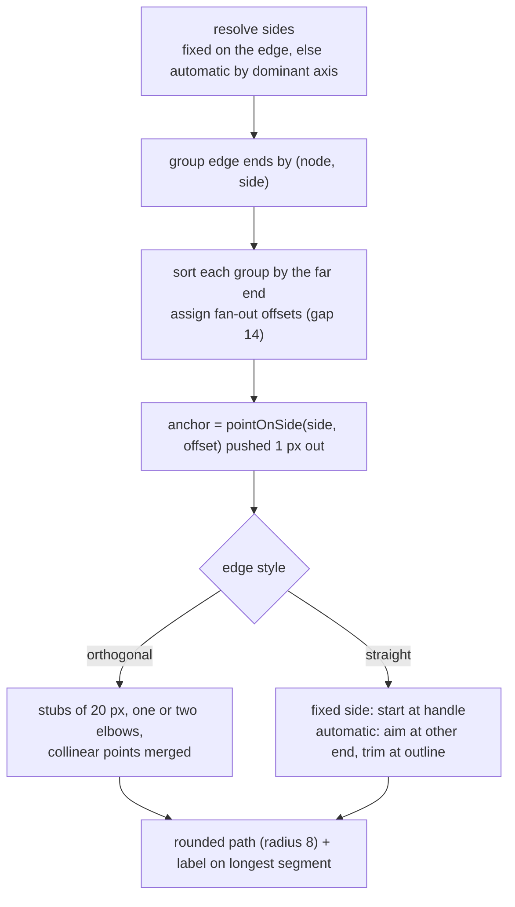
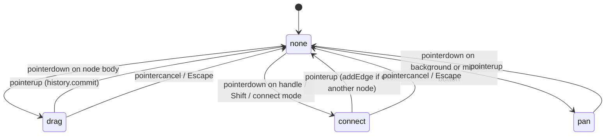

# Kesah architecture

This document explains the decisions and invariants behind Kesah, the things a reader cannot
recover by skimming the code. It is updated when a decision changes, not when code changes.
For usage and the file map see the [README](../README.md); for working rules see [AGENTS.md](../AGENTS.md).

## Layers

```mermaid
flowchart LR
  subgraph model["src/model (no DOM)"]
    graph["graph.ts<br/>document + notifications"]
    shapes["shapes.ts<br/>geometry of a node"]
    routing["routing.ts<br/>geometry of an edge"]
    layout["layout.ts<br/>sides, fan-out, route points"]
    history["history.ts<br/>undo/redo snapshots"]
  end
  state["src/state/app.tsx<br/>reactive view + editor state"]
  subgraph ui["src/components (SolidJS)"]
    atoms --> molecules --> organisms --> templates
  end
  graph --> state
  layout --> state
  history --> state
  state --> ui
  shapes --> layout
  routing --> layout
```

Three rules keep the layers apart:

1. **The model never touches the DOM.** `Graph`, geometry, routing and history are plain TypeScript
   with no imports from `solid-js` or the browser. They are testable with nothing but Node and can be
   reused by any renderer. Anything that needs the DOM (measuring text, hit-testing) is done in the
   UI and handed to the model as numbers.
2. **The state is the only bridge.** Components never touch `Graph` mutation logic they do not own:
   they call `graph.*` methods through the state, read reactive accessors, and use the actions the
   state exposes (`select`, `fitView`, `revealNode`, `zoomAt`, `addNodeAt`, `undo`, `redo`).
3. **Components are organised by atomic design.** Atoms know nothing about the application; molecules
   compose atoms; organisms read the application state; the template only arranges organisms.

## The document: `Graph`

- Nodes and edges are stored in insertion-ordered maps and **mutated in place**. Ids are `n1, n2, …`
  and `e1, e2, …`, continuing after the highest id present when a document is loaded.
- Every mutating method notifies subscribers **once, and only when something changed** (moving a node
  to where it already is does nothing). Undo, autosave and the reactive state all hang off this.
- `Graph.parse` is the only entry for untrusted data. It never throws for a bad node or edge; it drops
  them. It throws only when the value is not an object with `nodes` and `edges` arrays. Missing
  fields take the defaults that keep old files looking the same: `type` → `process`,
  `edgeStyle` → `straight`, `directed` → `true`, sides absent → automatic.
- A new, empty `Graph` is `directed` and `orthogonal`; a parsed file without `edgeStyle` is `straight`.
  This asymmetry is deliberate: new work gets elbows, old files keep their straight look.
- Self-loops are rejected. Several edges between the same two nodes are allowed since side handles
  exist; the fan-out (below) keeps them apart.

## Reactivity over an in-place model

Solid tracks signals, not object fields, and the graph mutates its objects. The bridge is a single
`revision` signal bumped on every graph change:

- Accessors such as `nodes()` and `edges()` are memos that read `revision()` and return fresh
  **arrays of the same objects**. `<For>` keys by object identity, so DOM elements survive changes and
  only what reads a changed field updates.
- Any computation that reads a field of a node or edge must also read `revision()` (see `NodeShape`,
  `NodeListPanel`, `InspectorPanel`). Wrapping such reads in `createMemo` stops propagation when the
  value did not change, which is what keeps a drag cheap: the moved node's `transform` updates, the
  rest is untouched.
- Do not return the same object from a memo and expect downstream to update when its fields change:
  memos compare by identity. Read the field inside the memo instead.
- Component inputs are never inline comma expressions such as `{(app.revision(), node.label)}`: the
  Vite dependency scanner rejects the comma operator inside JSX. Use a small accessor function.

Node sizes live in the state, not in the model. `NodeShape` measures its label once per label or
type change (`getComputedTextLength`, an effect, not a render read) and publishes the box; edges,
fit-to-view and node placement read it through `sizeOf`. Until measured, a node is assumed to have
the box of its label-less shape.

## Coordinates and the camera

- **Canvas coordinates** are what the document stores. **Screen coordinates** are client pixels.
- The camera is `view = { scale, tx, ty }`; the viewport `<g>` gets `translate(tx ty) scale(scale)`
  and the grid pattern gets the same transform so dots move with the content.
- `toWorld(clientX, clientY)` converts through the canvas bounding rect and the view. All gesture
  math happens in canvas coordinates; only the pan gesture works in screen deltas.
- Zoom keeps the canvas point under the cursor fixed and is clamped. Fit-to-view centres the content
  with 48 px of padding and never zooms in beyond 1. Reveal pans only if the node is off-screen.

## Geometry

### Shapes (`shapes.ts`)

Each node type has a sizing rule (width grows with the label, height is fixed), an outline path
centred on the origin, and two ways to find its border:

- `boundaryDistance(type, size, ux, uy)`: distance from the centre to the outline along a unit
  direction. Exact for the rectangle, the rhombus and the pill (the pill's end caps are solved as a
  circle intersection); the parallelogram is treated as its bounding box. Straight edges with
  automatic sides use it to stop at the border.
- `pointOnSide(type, size, side, offset)`: the point on the outline on a given side, `offset` units
  along that side. Exact for every shape, including the parallelogram's slanted sides. Used for the
  side handles and for fanning out edges that share a side. Offsets are clamped so the point stays
  on the shape.

Adding a shape means: a new `NodeType`, a sizing rule, an outline path, the two border functions,
a display name in `components/labels.ts`, and tests for each. Nothing else knows the list of shapes.

### Edges (`routing.ts`, `layout.ts`)



Routing rules, in order of precedence: sides of different orientation get one elbow; opposite sides
that face each other meet halfway between the stubs; equal sides, or opposite sides that do not
face, go round the outermost stub. The route never avoids other nodes: that is a documented
limitation, and the remedy is moving a node or fixing other sides. A route that folds back onto
itself is collapsed so no zero-length segment remains (the arrowhead needs a direction).

`layoutEdges` is pure and takes the node and edge lists; the state wraps it in a memo keyed by edge
id. Edge components look their layout up by id so `<For each={edges()}>` keeps its DOM.

## Gestures (`organisms/gestures.ts`)



The handlers are deliberately imperative: a gesture is a sequence of events with transient state.
They only call state actions and graph methods. Four subtleties were expensive to find and must
be preserved:

- **Capture on the node, not the svg.** With pointer capture, `click` and `dblclick` are dispatched
  to the capturing element; capturing on the svg would make a double-click on a node look like a
  double-click on the background.
- **Reorder before capturing.** The dragged node is moved to the end of its layer so it renders on
  top. Moving an element in the DOM releases pointer capture, so `setFrontNode` runs before
  `setPointerCapture`.
- **Hit-test the drop yourself.** During capture `e.target` is the source node, so the drop target is
  found with `document.elementFromPoint`, and it is looked up *before* the gesture ends: while
  connecting, the `connecting` class makes every node's handles take pointer events; once the class
  goes, the handle under the pointer would no longer be hit.
- **Keyboard shortcuts are global** (`window`) and ignored while the target is an input, textarea,
  select or editable element.

A drag opens a history transaction on `pointerdown` and commits it when the gesture ends, whichever
way it ends. Typing in the name field does the same between focus and blur.

## Undo/redo (`history.ts`)

Snapshots of the JSON form, kept in two stacks with a limit of 100 steps. Every graph change is a
step unless a transaction is open; nested transactions count as one. Restoring loads a snapshot
into the same `Graph`, which notifies as usual, so the UI, the autosave and the selection cleanup
all react without special cases. `History` is created after the document is loaded so the initial
state is the baseline, not an undoable step.

Restoring replaces node and edge objects. Anything keyed by object identity (the `<For>` DOM) is
recreated; anything keyed by id (sizes, selection) survives and is cleaned up if the id is gone.

## Persistence and the entry point (`main.tsx`)

The document is saved to `localStorage` under `kesah:graph`, debounced after each change. On start,
a saved graph with at least one node is restored through `Graph.parse`; otherwise the sample
flowchart is created. Export writes the same JSON with a `.json` name; import goes through
`Graph.parse` and reports the error with `alert`.

## Contract with the tests

- **Behaviour first.** Expectations come from the README and the agreed rules, not from the code.
  Undocumented constants (label offset, zoom limits, handle margin, autosave delay) are tested as
  properties, never as literal values.
- **Stable DOM contract.** Ids, classes and `data-*` attributes are part of the public surface used
  by unit tests and by the Chrome end-to-end script: `#status`, `#chk-directed`, `#chk-orthogonal`,
  `#btn-new/-undo/-redo/-fit/-export/-connect/-delete`, `#file-import`, `#add-node-tools button[data-type]`,
  `#inspector-form/-empty/-title/-info`, `#inp-label`, `#type-field`, `#sel-type`,
  `#source-side-field`, `#sel-source-side`, `#target-side-field`, `#sel-target-side`,
  `#node-list button .node-name`, `#node-count`, `.canvas.connect-mode/.connecting`,
  `.node[data-id][data-type] path/text/.port[data-side]`, `.edge[data-id] .edge-hit/.edge-line/.edge-label`,
  `.viewport`, `pattern#grid`, `marker#arrow/#arrow-selected`. Renaming any of them is a breaking change.
- **jsdom stand-ins.** `src/test/setup.ts` provides text measurement (7 px per character), pointer
  capture and `elementFromPoint`. These replace the environment, never the unit under test.
- **Mutation check.** `scripts/verify-tests.mjs` breaks each unit in a known way and expects its tests
  to fail. A new unit gets a new entry there.

## Known limitations

- Edges do not route around nodes; crossings are the user's to fix by moving nodes or fixing sides.
- No self-loops.
- Labels are single-line; a very long label makes a very wide node.
- Undo/redo shortcuts are not blocked during a gesture; using them mid-drag is unspecified.
- One document at a time; no multi-selection, no copy/paste, no touch-specific gestures beyond what
  pointer events give for free.

## Extension points

- **A new shape**: see *Shapes* above; the picker, the inspector and the icons follow `NODE_TYPES`.
- **A new tool or action**: add the action to `AppState` (it owns the graph and the camera), a button
  in the right organism, and a keyboard shortcut in `gestures.ts` if it needs one.
- **A new node or edge property**: add it to the model type and to `Graph.parse` with a default for
  old files, then to the inspector; keep the JSON backwards compatible.
- **Another renderer**: the model and `layoutEdges`/`routeOf` need only a size lookup; everything under
  `components/` is replaceable.
